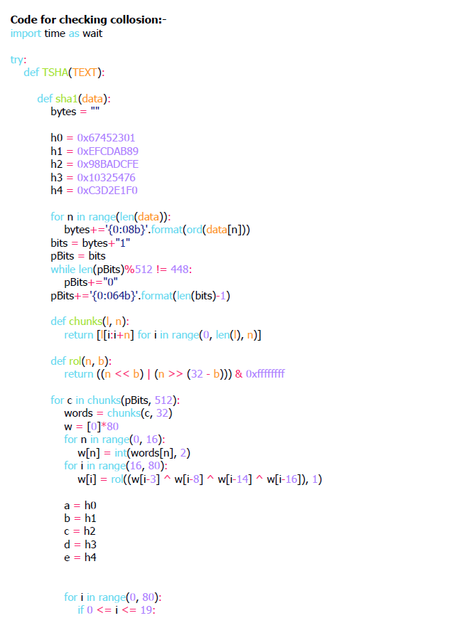
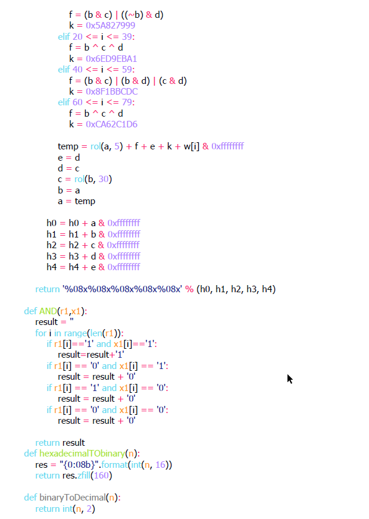
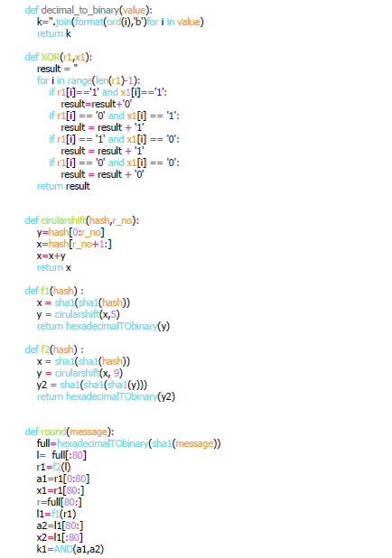
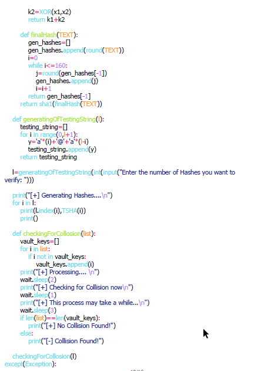
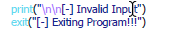

# Totally Secure Hashing Algorithm(T-SHA)

Abstract/Problem statement:- Doctoring of documents have been quite common these days. I Proposed a method to verify fake documents using cryptography techniques and designed and modified original SHA-1 algorithm to make it collision free and harder to Brute Force.

## Instructions

#### I've Attached a pdf file which contains documentation and the code for the testing and hashing algorithm.

#### This was my 1st Project. So there can be mistakes and i've also tested this algorithm it works like a charm.

## Usage

#### More code and project related things available in repository.

## Contributing
Pull requests are welcome. For major changes, please open an issue first to discuss what you would like to change.

Please make sure to update tests as appropriate.

## License
[MIT](https://choosealicense.com/licenses/mit/)
